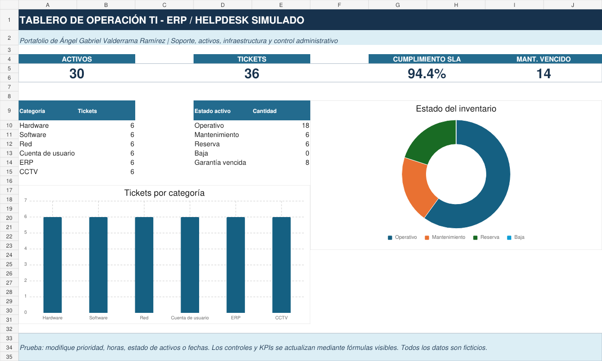

# Portafolio de soporte, ERP e infraestructura TI

Proyecto demostrativo de **Ángel Gabriel Valderrama Ramírez**, orientado a posiciones de Ingeniero de Sistemas Jr., Soporte Técnico e Infraestructura.

El caso integra inventario de activos, mesa de servicio, ERP, CRM/Helpdesk, SQL, redes, VLAN, CCTV, mantenimiento y respaldos. Todos los datos, usuarios, direcciones y equipos son ficticios.

## Componentes

| Componente | Evidencia | Habilidades demostradas |
| --- | --- | --- |
| ERP/Helpdesk | `ERP_Helpdesk_Infraestructura_Demo.xlsx` | Inventario, tickets, SLA, mantenimiento, validación y dashboard |
| Base de datos | `database/` | Modelo relacional, claves, restricciones, índices y consultas SQL |
| Redes | `network/PLAN_RED.md` | VLAN, direccionamiento, Wi-Fi, CCTV, segmentación y pruebas |
| Infraestructura | `infrastructure/RUNBOOK.md` | Soporte, respaldos, activos, mantenimiento y cambios |
| Evidencias | `evidence/` | Imágenes del libro para revisión rápida en GitHub |

## Vista previa

## Cómo revisar el portafolio

1. Descarga y abre `ERP_Helpdesk_Infraestructura_Demo.xlsx` en Microsoft Excel.
2. Revisa el dashboard y modifica prioridades, horas, estados o fechas.
3. Ejecuta los archivos SQL en el orden indicado en `database/README.md`.
4. Revisa la segmentación y las pruebas propuestas en `network/PLAN_RED.md`.
5. Consulta el flujo operativo en `infrastructure/RUNBOOK.md`.

## Alcance honesto

- El ERP y Helpdesk son una simulación construida en Excel, no un producto comercial.
- El modelo SQL es demostrativo y utiliza información ficticia.
- El diseño de red es una propuesta técnica; no documenta infraestructura real.
- El proyecto prueba conocimientos y capacidad de documentación.

## Perfil

- Estudiante de Ingeniería en Informática en UPIICSA-IPN.
- Técnico en Soporte y Mantenimiento en Equipos de Cómputo.
- Experiencia práctica en formateo, instalaciones, respaldos, inventario y soporte remoto/presencial.
- Experiencia con VLAN, switches, CCTV, ERP como usuario, CRM/Helpdesk y bases de datos SQL.

- GitHub: [@sssexpistols](https://github.com/sssexpistols)
- Correo: [gabrielasies6@gmail.com](mailto:gabrielasies6@gmail.com)

## Privacidad

No se incluyen credenciales, datos personales reales, información bancaria, configuraciones productivas ni datos de terceros.

