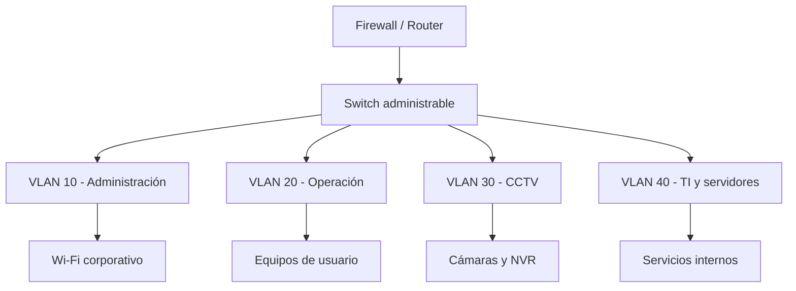

# Diseño de red y segmentación VLAN

Propuesta demostrativa para una sede pequeña con usuarios administrativos, operación clínica, CCTV e infraestructura. No corresponde a una red real.

## Plan de direccionamiento

| VLAN | Uso | Red demostrativa | Gateway | Política principal |
| --- | --- | --- | --- | --- |
| 10 | Administración | `10.10.1.0/24` | `10.10.1.1` | Acceso a ERP y servicios autorizados |
| 20 | Operación | `10.20.1.0/24` | `10.20.1.1` | Acceso limitado a aplicaciones internas |
| 30 | CCTV | `10.30.1.0/24` | `10.30.1.1` | Cámaras aisladas; comunicación solo con NVR y monitoreo |
| 40 | TI/Servidores | `10.40.1.0/24` | `10.40.1.1` | Administración restringida al personal de TI |
| 50 | Invitados | `10.50.1.0/24` | `10.50.1.1` | Solo Internet; sin acceso a redes internas |

## Controles propuestos

- Separar usuarios, CCTV, invitados y administración mediante VLAN.
- Aplicar listas de control entre segmentos bajo el principio de mínimo privilegio.
- Cambiar credenciales predeterminadas y deshabilitar servicios sin uso.
- Mantener respaldos cifrados de configuraciones de switches, firewall y puntos de acceso.
- Documentar puertos, direcciones IP, equipos, responsables y fechas de cambio.
- Utilizar una red Wi-Fi independiente para invitados y autenticación robusta en la corporativa.
- Restringir la administración de dispositivos a la VLAN 40.
- Sincronizar horarios mediante NTP para conservar trazabilidad en tickets y CCTV.

## Pruebas de aceptación

1. Un dispositivo de invitados no puede alcanzar ninguna subred interna.
2. Las cámaras solo pueden comunicarse con el NVR, DNS/NTP autorizados y monitoreo.
3. Los usuarios acceden al ERP, pero no a interfaces de administración.
4. TI puede administrar dispositivos desde una estación autorizada.
5. El inventario coincide con puertos, VLAN, IP y ubicación documentados.

